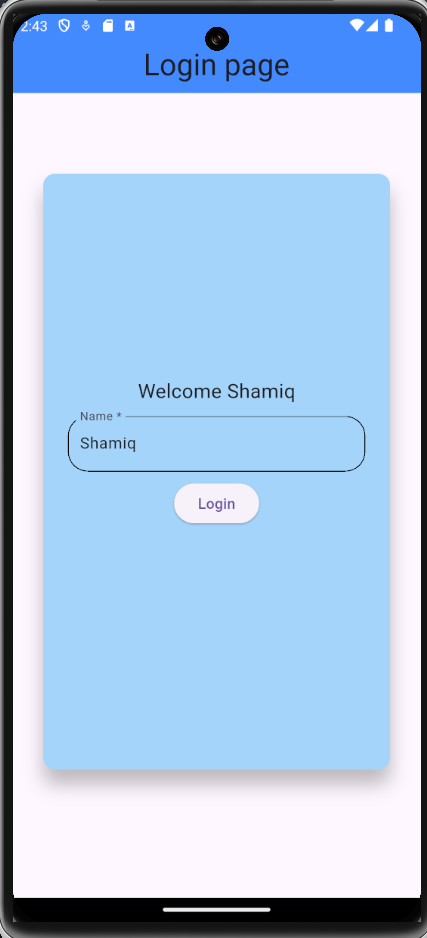
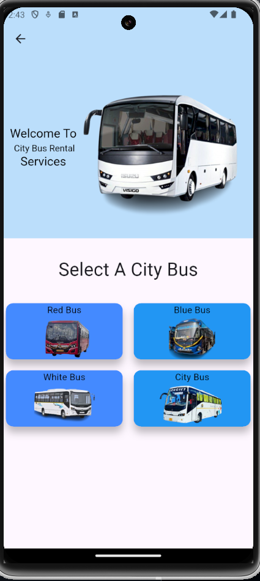
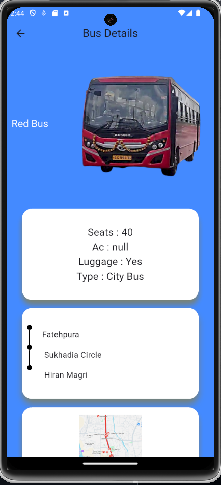
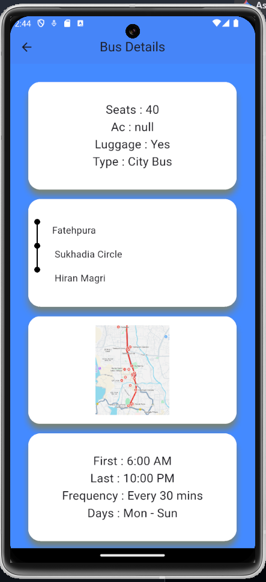
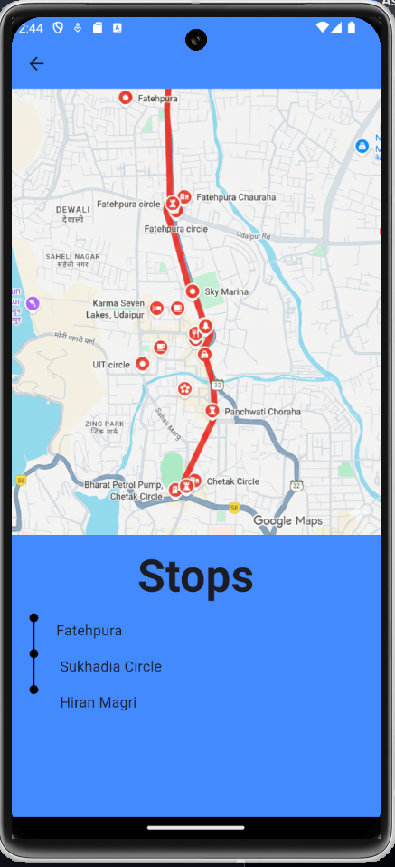

# 🚌 Bus Tracking & Route Information App

A Flutter-based bus management and route information application that helps users explore available buses, view detailed route information, check bus schedules, and visualize routes on an interactive map. The app provides a clean and user-friendly interface for accessing transportation information efficiently.

---

## ✨ Features

* User Login Authentication
* Clean and Responsive Flutter UI
* Browse Available Buses
* View Detailed Bus Information
* Bus Timing & Schedule Display
* Route Information and Stops
* Interactive Navigation Between Screens
* Route Visualization on Map
* Organized Transportation Information
* Mobile-Friendly User Experience

---

## 📱 App Screens

### 🔐 Login Screen

The Login Screen serves as the entry point of the application, allowing users to securely access the bus information system through a simple and intuitive interface.

  

---

### 🏠 Home Screen

The Home Screen displays the available buses and transportation options. Users can browse different buses and select a specific bus to view detailed information, schedules, and route details.

  

---

### 🚌 Bus Details Screen

The Bus Details Screen provides comprehensive information about a selected bus, including route details, departure and arrival timings, important stops, and additional information about the service.

  
  

---

### 🗺️ Route Map Screen

The Route Map Screen visually displays the selected bus route on an interactive map, helping users better understand the journey path and route coverage.

  

---

## 🛠️ Tech Stack

* Flutter
* Dart
* Google Maps / Maps Integration
* Material Design

---

## 🎯 Key Concepts Demonstrated

* Flutter UI Development
* Responsive Design
* Navigation & Routing
* Map Integration
* Information Management
* User Authentication
* Screen-to-Screen Data Passing
* Clean UI Architecture

---

## 🚀 Future Improvements

* Real-Time Bus Tracking
* Live Bus Location Updates
* Estimated Arrival Times
* Route Search Functionality
* Favorite Routes
* Push Notifications for Bus Arrivals
* Dark Mode Support
